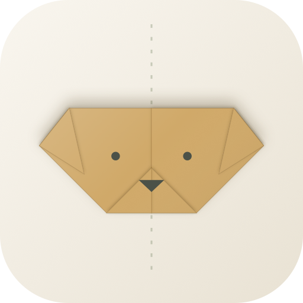
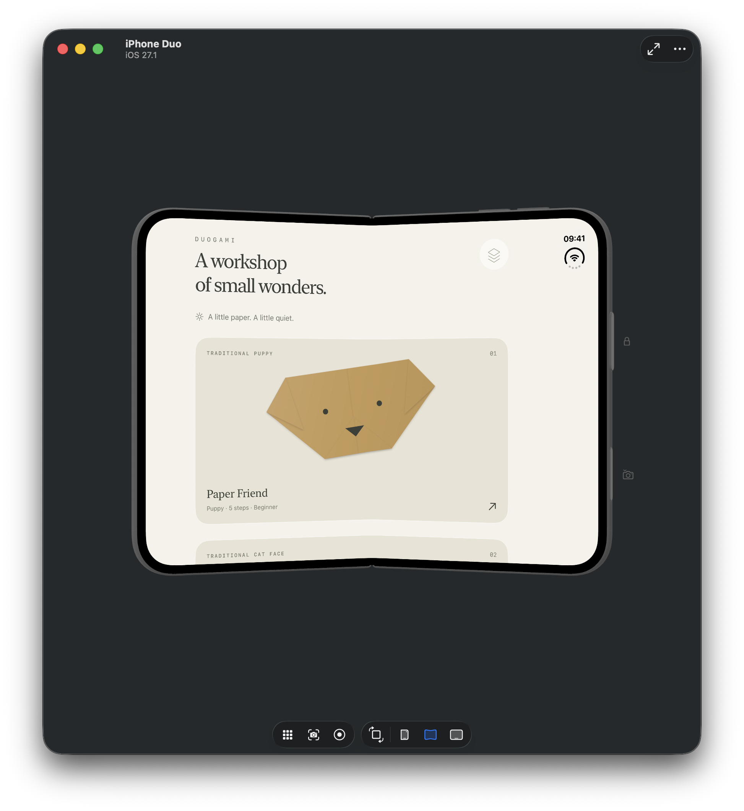
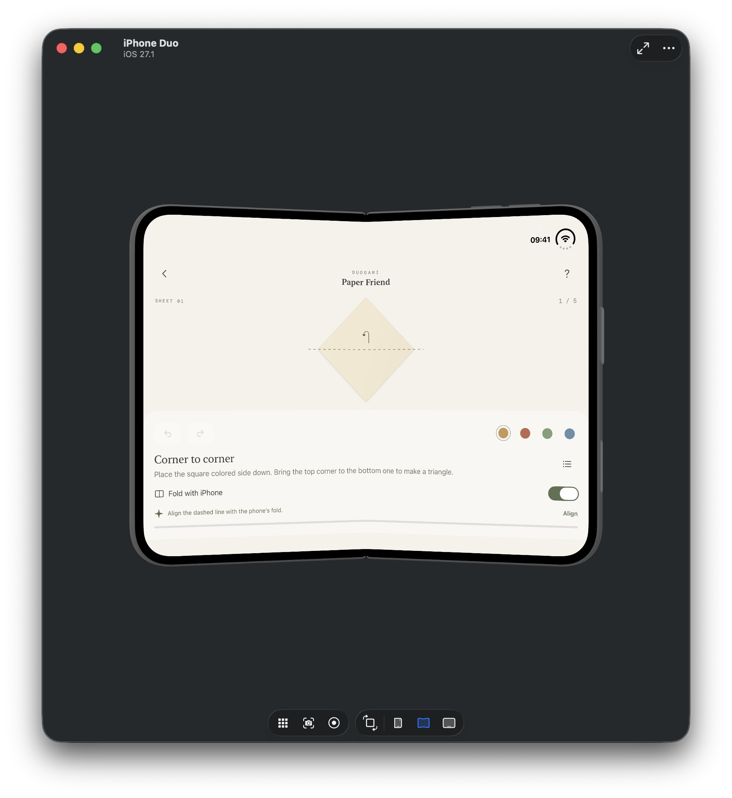

<p align="center">
  
</p>

<h1 align="center">Duogami</h1>

<p align="center">
  A minimalist origami workshop for the foldable <b>iPhone Duo</b>. Fold the phone to fold the paper.
</p>

<p align="center">
  
  
  
  
  <a href="LICENSE"></a>
</p>

<p align="center">
  
  
</p>

A warm work surface, two-sided paper, visible creases and soft shadows between layers.

## Features

- **Lessons.** Three traditional faces: a puppy, a kitten and a fox. Follow along with a real square sheet, about 15 × 15 cm.
- **Free Fold.** Move and rotate a blank sheet, fold along any straight line, crease and unfold, flip the paper.
- **My works.** Everything saves automatically. Review your own folds step by step.
- **Result.** Four paper colors and an image of the finished model to share.

## How to Fold

Turn on **Fold with iPhone**. In a lesson, tap **Align** if the dashed line doesn't match the hinge. Open the phone, then gently close it: the paper folds with a light haptic tap. Open it again for the next step. There's no need to close the phone all the way.

No hinge? Use the slider and the **Fold** button instead.

In Free Fold, drag the paper with one finger and rotate it with two.

## Requirements

- Xcode 27.1+
- iOS 27.1+ SDK
- iPhone Duo simulator or device for the hinge. On other devices, use the slider.

## Building

```bash
xcodebuild -project Duogami.xcodeproj -scheme Duogami \
  -destination 'platform=iOS Simulator,name=iPhone Duo' build
```

## Project Structure

```
Sources
├── Core        # Paper geometry, lessons, sessions and saving
├── Views       # Collection, workshop, paper canvas and history
└── Resources   # Asset catalog
```

The Xcode project uses Xcode's JSON project format ([`project.xcproj`](Duogami.xcodeproj/project.xcproj)). Each source file is listed there with its target membership.

## Limitations

Duogami folds flat, straight folds. It doesn't simulate collisions or stretching, so not every Free Fold model can be folded from real paper. Pockets, squash and reverse folds aren't supported yet.

## Pattern Sources

The lessons follow traditional models from [Origami Instructions](https://www.origami-instructions.com): [dog face](https://www.origami-instructions.com/origami-dog-face.html), [cat face](https://www.origami-instructions.com/origami-cat-face.html) and [fox face](https://www.origami-instructions.com/origami-fox-face.html). Illustrations, proportions and wording are original; third-party photos, diagrams and text were not copied. The kitten folds its top corner before the ears.

For more iPhone Duo APIs, see [iPhone Duo by Examples](https://github.com/artemnovichkov/iPhone-Duo-by-Examples).

## Author

Artem Novichkov, https://artemnovichkov.com/

## License

The project is available under the MIT license. See the [LICENSE](./LICENSE) file for more info.
