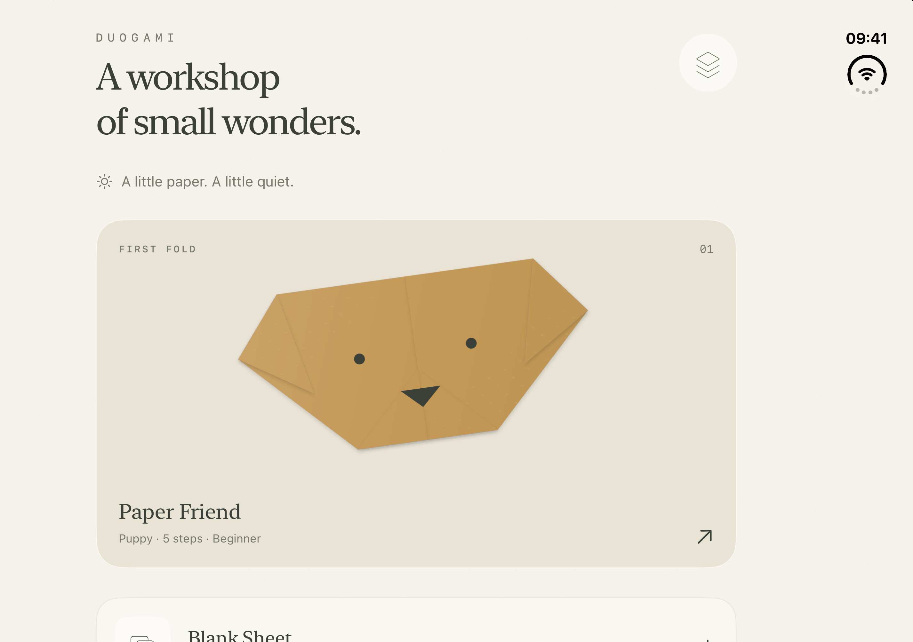
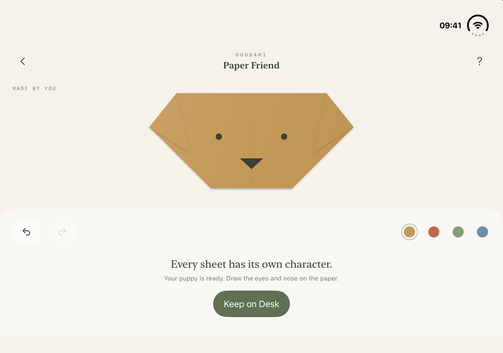

# Duogami

A minimalist origami workshop for iPhone Duo. A warm work surface,
two-sided paper, visible creases and soft shadows between layers.

<p>
  
  
</p>

## First working version

- **Guided:** three traditional faces — puppy (5 steps), kitten and fox
  (6 steps each, ending with a turn-over). Step-by-step instructions,
  overview of all steps, undo and redo. You can follow along with a real
  square sheet (e.g. 15 × 15 cm).
- **Free Fold:** move and rotate the sheet, arbitrary straight fold,
  switch the folding side, all layers or top face, flip the paper,
  fold-and-unfold crease.
- **Two input methods:** the Duo hinge, or a preview slider and button.
- **My works:** automatic local saving after actions and on exit,
  geometry restored from history, step-by-step review of your own sequence.
- **Result:** four paper colors and image export of the finished model.
- Reduce Motion disables the confirmation animation; controls have
  accessibility labels. VoiceOver does not replace Free Fold spatial gestures.

## Running

Requires Xcode 27.1 and the iOS 27.1 SDK. Open `Duogami.xcodeproj` and select iPhone Duo.

```sh
xcodebuild -project Duogami.xcodeproj -scheme Duogami \
  -destination 'platform=iOS Simulator,name=iPhone Duo' build
```

Bundle ID: `com.artemnovichkov.Duogami`. The project is fully standalone,
does not depend on the Duo by Examples sources and uses no third-party packages.

## How to fold

Turn on “Fold with iPhone”. In a lesson, tap “Align” if the dashed line doesn't
match the hinge. Open the device (from 155°), then gently close it (to 80°).
Confirmation comes with haptic feedback. Afterwards, open the phone for the next
action: the completed paper fold is kept.

The device doesn't need to be fully closed. Losing hinge context, a layout change,
the app going to background or opening help resets an unfinished gesture.
Thresholds are initial prototype settings, not API precision requirements.

The hinge line is located via reserved regions, including inactive ones. On the
outer display and without hinge context, on-screen controls are used. Hinge event
delivery rate is not assumed to be fixed.

Free Fold: drag the paper with one finger, rotate with two. Position snaps to the
center and vertices; after rotation the angle is rounded to the nearest 15°.
The toolbar has 90° rotation, flip and fold side switching.

## Architecture

```text
Sources/
  Core/
    PaperGeometry.swift     # Convex faces, clipping, reflections, stack, hinge gesture
    Pattern.swift           # Declarative traditional lessons, face drawings and palette
    WorkshopSession.swift   # Session, undo/redo, replay, atomic JSON persistence
  Views/
    CollectionView.swift    # Collection and saved works
    WorkshopView.swift      # Workshop, hinge input, onboarding and result
    PaperCanvas.swift       # Fold projection, materials and shadows
    HistoryView.swift       # Review of own diagram without modifying the work
  DuogamiApp.swift
Tests/
  CoreTests.swift
  SessionTests.swift
```

Sheet coordinates are screen-independent. Each operation stores an axis, the moving
half-plane and face selection. Moving faces are reflected, their order and sides
inverted. With “crease and unfold”, faces are split, keeping the crease line.
Turning over mirrors the stack around the vertical center line.
One engine serves both the lessons and free mode.

The project uses the Xcode JSON format (`project.xcproj`). When adding files,
explicitly include them in `files` and `Duogami/compile-sources`.

## Checks

```sh
bash Tests/run.sh
```

Covers sheet area preservation, reflections at various angles, refolding along an
existing crease, face order, every action of every lesson, face drawings staying on the paper, replay, undo/redo,
save/restore and protecting a corrupted file from being overwritten. Hinge checks
cover repeated confirmation, threshold jitter, missing context and resuming after
interruption. Test files are created in a temporary directory.

Manual check in Device Hub: complete the lesson, undo/redo a step, relaunch the
app, open a save, check Free Fold and its diagram review. Separately check the
“open → fold → open” cycle, both displays and both orientations.
Simulator fold state is changed manually.

Verified September 19, 2026: build for iPhone Duo Simulator; 276 geometry, replay
and hinge recognition checks plus 26 session and persistence checks. The owner
manually confirmed the 2 → 3 transition fires exactly once per physical fold cycle
in Device Hub.

## Prototype limits

This is a geometric editor for flat folds, not a general physical origami
simulator. It doesn't check collisions, stretching or flap connectivity after
an arbitrary top-face selection, so not every free fold can be reproduced
physically. “Top face” means one convex piece, not the whole connected top layer.
Pockets, squash/reverse folds and 3D openings are not implemented yet.

History is limited to 200 actions, geometry to 512 faces. Saves are local;
renaming, deleting, diagram import/export and sync are not available yet.
Sound, app icon, more lessons and on-device testing are next steps. The built-in
diagrams are verified programmatically but still need a manual fold on real paper.
The light palette is fixed for now.

## Pattern sources

- **Puppy:** [Origami Dog Face — Origami Instructions](https://www.origami-instructions.com/origami-dog-face.html).
  Traditional sequence: diagonal, center crease, two ears, bottom tip.
- **Kitten:** [Origami Cat Face — Origami Instructions](https://www.origami-instructions.com/origami-cat-face.html).
  Traditional folds: diagonal, center crease, two ears up, top corner down, turn over.
  The top corner is folded before the ears, because the engine folds whole
  layers and would otherwise catch the ear tips.
- **Fox:** [Origami Fox Face — Origami Instructions](https://www.origami-instructions.com/origami-fox-face.html).
  Traditional sequence: diagonal, center crease, top to bottom edge, both sides
  up to the center, turn over.

Proportions come from the app's own geometry; third-party photos, diagrams
and text were not copied. Eyes, noses and whiskers are a decorative drawing
added with a pencil on real paper.

Duo API approaches are based on [iPhone Duo by Examples](https://github.com/artemnovichkov/iPhone-Duo-by-Examples).
